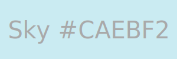

# devdiary

- TODO
- Multiple diaries for different projects
- Add simple images to entries
- Keywords for entries

- login, so site can be public
- share entry/diary by url
asd
## Plugins

- https://github.com/showdownjs/showdown

## Colors

</img>
</img>
</img>
</img>